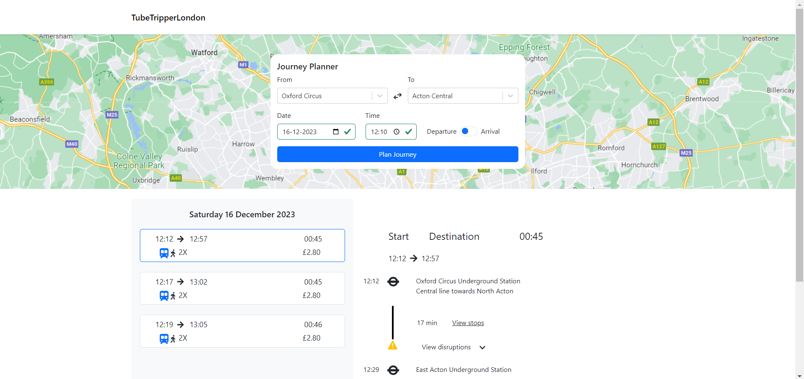

# TubeTripperLondon
TubeTripperLondon (TTL) is a journey planner webapp for planning tube journeys in the city London, UK. TTL uses the Transport for London (TfL) API for this.



TTL is hosted by Amazon Web Services (AWS). However, the application can also run on `localhost`, follow the steps below to do this.

## Prerequisites
Node.js and npm need to be installed. TTL was developed using Node.js version `18.17.1`.

You need to have access to the Transport for London API. You can register here: https://api-portal.tfl.gov.uk/. It will guide you through the process of acquiring an `app_id` and an `app_key`. 

## Installation
This repository contains both the frontend and backend code projects. Dependencies need to be installed for both of them.

### Frontend
The frontend of TTL is a React.js app. To install, follow the steps below:

1. `cd` into `./frontend`
2. Install the dependencies:
```
npm install
```
3. Create a `.env` file and paste the following contents in it:
```
REACT_APP_API_URL="http://localhost:3000"
GENERATE_SOURCEMAP=false
```

You have now installed and configured the frontend application.

### Backend
The backend of TTL is a Node.js with Express app. To install, follow the steps below:

1. `cd` into `./backend`
2. Install the dependencies:
```
npm install
```
3. Create a `.env` file and paste the following contents in it:
```
TfL_APP_ID="<your_app_id>"
TfL_APP_KEY="<your_app_key>"
TfL_BASE_URL="https://api.tfl.gov.uk"
TfL_JOURNEY_ENDPOINT="/journey/journeyresults"

ENV="development"
REDIS_PRIMARY_ENDPOINT=""
```
**Note:** replace `<your_app_id>` and `<your_app_key>` with your TfL credentials. When logged in on the TfL website, you can find these keys on the "Profile" page here: https://api-portal.tfl.gov.uk/profile. The "Primary key" is the `app_id`, the "Secondary key" the `app_key`.

4. To be able to make use of the caching functionality of TTL, Redis should be installed on your system. Follow the steps for you operating system here: https://redis.io/docs/install/install-redis/. For Windows, use WSL and run the following commands:
```
sudo apt update
sudo apt-get install redis
```

5. Start the Redis server by running:
```
redis-server
```
This will keep the Redis server running for as long as you keep the terminal open.

> You can use [RedisInsight](https://redis.com/redis-enterprise/redis-insight/) for a visual view of the cache.

You have now installed and configured the backend application.

## Usage
To start using TTL, follow the steps below (the order is important):
1. When in `./backend`, start the backend application:
```
npm run start
```
This will start the app on http://localhost:3000.

2. When in `./frontend`, start the frontend application:
```
npm run start
```
This will prompt you to run the application on another port because of something already running on port `3000`. Type "y" and enter. This will start the app on http://localhost:3001/.

3. Go to http://localhost:3001/ in a browser. You will be presented with the home page of TTL where you can start planning tube journeys.

## Tests
If you are interested in running the software tests of TTL, you can do so by running `npm run test` in either `./frontend` or `./backend`.
